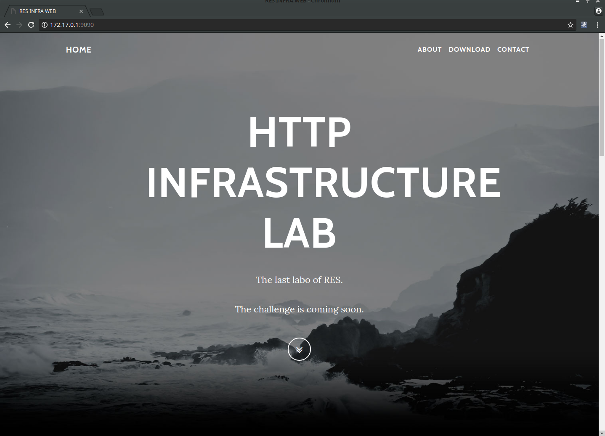

# RES - HTTP Infrastructure - Lab report
---
## Step 1 : Static HTTP server with apache httpd
On this first step, we build a simple static webpage running on dockerised Apache server. We use bootstrap's template to build quickly with our own content.
We build the content up  in `src/` in our local machine. When we create the dockerised server Apache, we copy the   `src/` folder into the local file system of the image  `/var/www/html/` according the Apache setup. The docker image is based on `php:7.0-apache` container. This container is packaged with Apache web server.

this command build the image. We assume that the current directory hold our `Dockerfile`.

how to explore the file system of the image
we execute the bash to have prompt on the container
```docker
docker exec -it container-name /bin/bash
```
This below table show off our setup command

| docker command                             |            Description  |
| -------------                              |:------------- -----:|
|  ` docker build -t res/apache-php-static .`| Building the static content web server. The    current directory hold our `Dockerfile` |
| ` docker run -d -p 9090:80 --name web-static res/apache-php-static`      | Run the container based on the image that we have been created before. This container listen on the 80 and the docker expose the port 9090.|

how to explore the file system of the image
we execute the bash to have prompt on the container
```docker
docker exec -it container-name /bin/bash
```

We run the container `web-static ` based on the image ` res/apache-php-static`. This below image show off the result.

