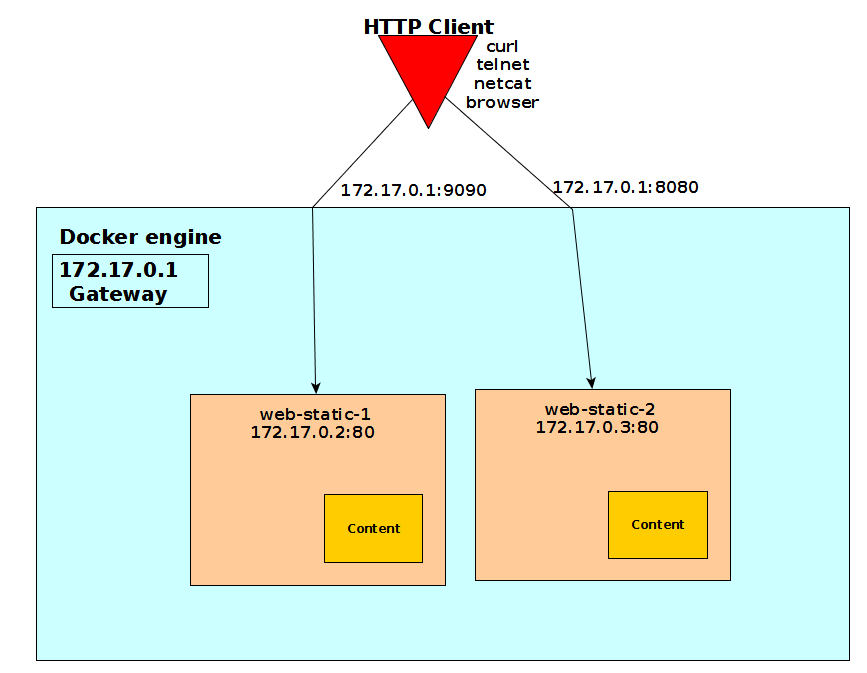
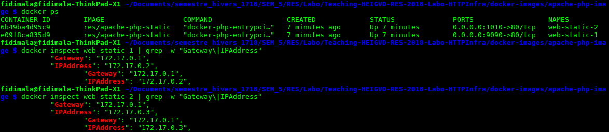
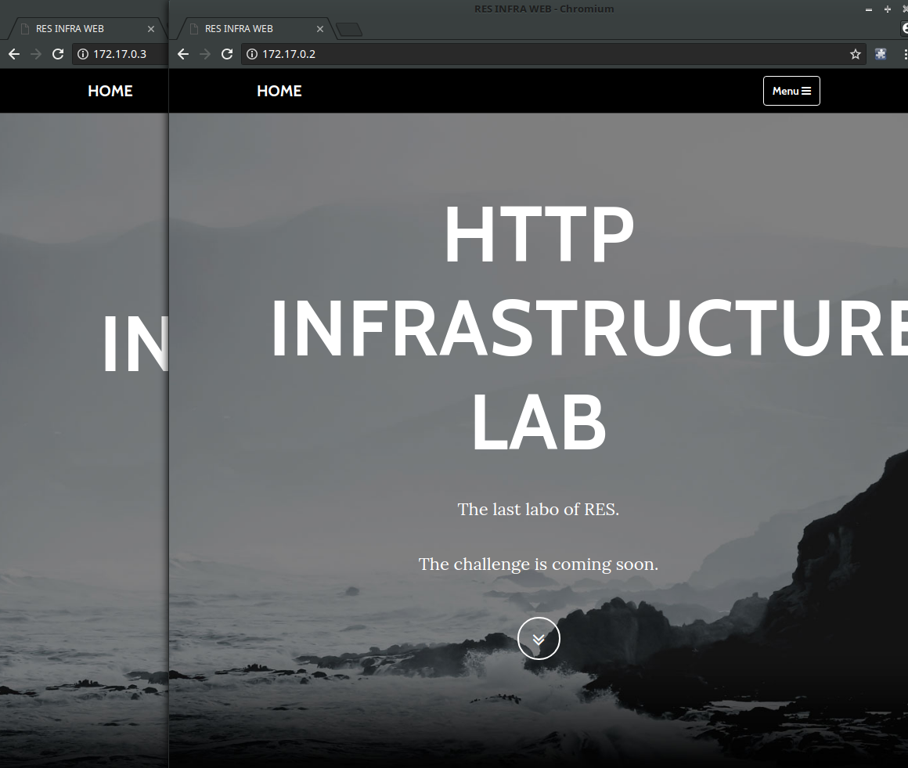
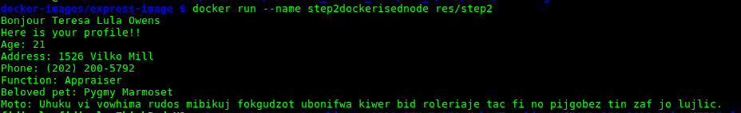
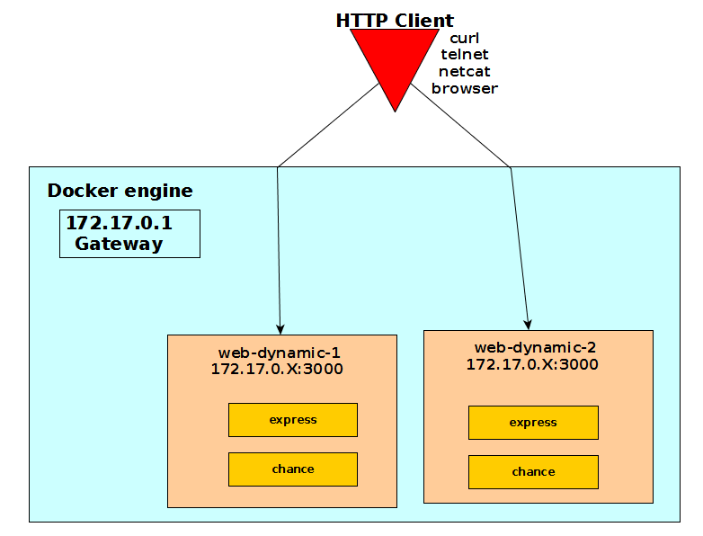
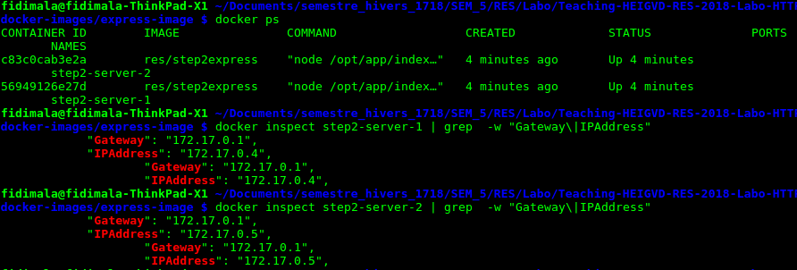
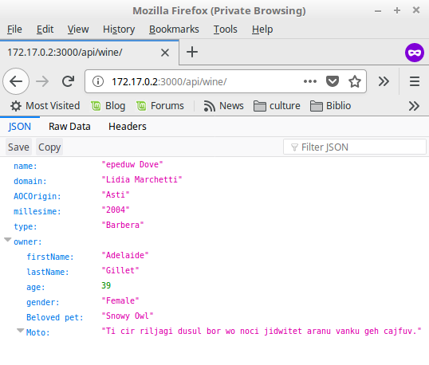
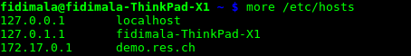
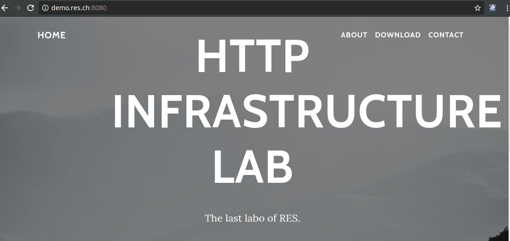
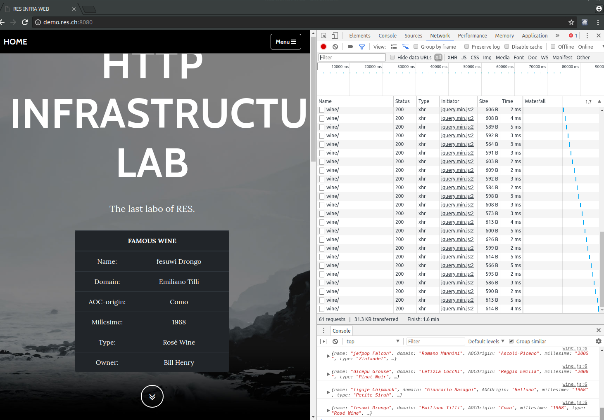

# RES - HTTP Infrastructure - Lab report
---
## Step 1 : Static HTTP server with apache httpd
On this first step, we build a simple static webpage running on dockerised Apache server. We use bootstrap's template to build quickly with our own content.
We build the content up  in `src/` in our local machine. When we create the dockerised server Apache, we copy the `src/` folder into the local file system of the image  `/var/www/html/` according the Apache setup. The docker image is based on `php:7.0-apache` image. This image is packaged with Apache web server.

This command build the image. We assume that the current directory hold our `Dockerfile`.
We use the default apache configuration for this step. All we have to do is to building the docker image with our static content.

This below table show off our setup command

| docker command                             |            Description  |
| -------------------------------------------|:------------------:|
|  ` docker build -t res/apache-php-static .`| To build the static content web server. The    current directory hold our `Dockerfile` |
| ` docker run -d -p 9090:80 --name web-static res/apache-php-static`      | To run the container based on the image that we have been created before. This container listen on the 80 and the docker expose the port 9090. we change the exposed port when we run another container.|

We inspect the container to check out his IP address.We use , in linux machine,  the docker engine IP address because the container use docker IP as a gateway.

We run the container `web-static ` based on the image ` res/apache-php-static`. This below image show off the result. We connect to our static web using the port-mapping providing by docker.

Otherwise, we can connect directly knowing the container IP address.

## Step 2:  Dynamic HTTP server with express.js
### set up node server
The node-tiers help us to generate the dynamic ressource. The express.js is our web framework. This dynamic ressource mimics data that feed up the express.js which renders web content. This framework provides an API to render fashion web page.
The dynamic ressource is generated by the node module `chance`. This below image show off how the dockerised node run. This node app create randomly a wine feature. These feature include:
- name
- domain
- AOC-origin
- millesime
- type
- owner

The owner holds the information about the owner of the vineyard domain.

## set up `express.js`
The `express.js` framework is used on top of our profile generator. The profile is presented in json fashion and feed the `express.js` framework to this data. The `express.js` renders the web page.

| docker command                             |            Description  |
| -------------------------------------------|:------------------:|
|  ` docker build -t res/step2express .`| Building the dynamic content web server image. The    current directory hold our `Dockerfile` |
| ` docker run --name step2 res/step2express`      | Run the container based on this image that we have been created before. This container listen on the 3000.|

Before we connect with our server, we obviously need to check out the container IP address. Thanks to ` docker inspect step2 | grep -w "gateway\|IPAddress"` command, we easly find out this IP address.

 We can get the random content from the express server using this address at the right port.

## Step 3: Reverse proxy with apache (static configuration)
On this step, we deploy a reverse-proxy server. This server mimics the gateway server. The httpd itself does not generate or host the data. The content is obtained by static web server (step 1) and the dynamic express server (step 2). Those back-end server have not direct access to the external. The reverse-proxy is the only one entry-point.

### Apache configuration
Thanks to  `(proxy,proxy_http)` module, we can activated the reverse-proxy feature in apache server. The virtual site help use to perform the server-proxy. We make up a configuration file, `001-reverse-proxy.conf`, which contains the URI mapping. We are enabled the 000-default.conf to ensure that the Apache server apply only our configuration when own configuration is enabled. If the request ressource is not included in our virtual host, httpd should get back an error message to the client. The request is ended up in the proxy server.

#### configuration directive in `001-reverse-proxy.conf`

| directive                            |            Description  |
| -------------------------------------------|:------------------:|
|  ` ProxyPass "/api/wine/" "http://172.17.0.2:3000/api/wine/"`| the inbound request handler the ressource `/api/wine` which is specified to perfom the mapping and determine the backend express server who handle this request |
| ` ProxyPassReverse "/api/wine/" "http://172.17.0.2:3000/api/wine/`      | outbound : HTTP response back to the client|

### Deployement dockerised server
| docker command                             |            Description  |
| -------------------------------------------|:------------------:|
|  ` docker build -t res/apache-reverse-proxy .`| Building the reverse-proxy web server image. The  current directory hold our `Dockerfile` |
| ` docker run -d -p 8080:80 --name step3 res/apache-reverse-proxy`      | Run the container based on this reverse-proxy image that we have been created before. This container listen on the 8080.|

### Resolution name
The proxy respond only on the domain demo.res.ch that we set up early.
We set up the resolution name locally due to our server local. We add our domain information in the  `/etc/hosts`. We assume that the proxy has `172.17.0.1` IP Address.
By the way, the proxy respond to our request.

We can connect with the reverse proxy server using this domain

## Step 4: AJAX requests with JQuery
On this step, we manage to fetch the dynamic data from the express server into static web page. The AJAX request using `/api/wine/` URI is used to fetch the dynamic data in the static web page from express server. The inbound dynamic data is binded on the DOM element of the static web page. Every an ellapse time, the static web page fetch the data from the dynamic express server. The static web page retrieves the data each 2 secondes.

## Step 5: Dynamic reverse proxy configuration
The main idea is to override the reverse proxy configuration file.
According the webcast, starting the container override the IP address static and dynamic thanks to environment variable  `-e STATIC_APP=172.17.0.x -e DYNAMIC_APP=172.17.0.y`.

| command                             |            Description  |
| -------------------------------------------|:------------------:|
|  ` docker run -d -p 8080:80 -e STATIC_APP=172.17.0.x -e DYNAMIC_APP=172.17.0.y --name apache_rp res/apache_rp`| Starting the container add setup the environment variable that keep on the IP Address static and dynamic. During this process the script bash `apache2-foreground` calls. |
| ` php /var/apache2/templates/config-template.php > /etc/apache2/sites-available/001-reverse-proxy.conf`      | During the starting process, this command override the static configuration we have on the step 4 thanks to available environment variable that we define earlier. The `foreground` script hold this command. |

## Bonus
### Load balancing: multiple server nodes

[source load balancing](https://www.elastichosts.com/blog/add-a-front-end-apache-cloud-load-balancer/)

Thanks to the module `proxy_balancer`, we can enable this apache feature like we do with reverse proxy. We add the command to enable this module on our Dockerfile. The `proxy_balancer` can keep track of sessions, so a single user always deals with the same backend web server.

#### Enabled load balancing

### Load balancing: round-robin vs sticky sessions

### Dynamic cluster management

### Management UI
