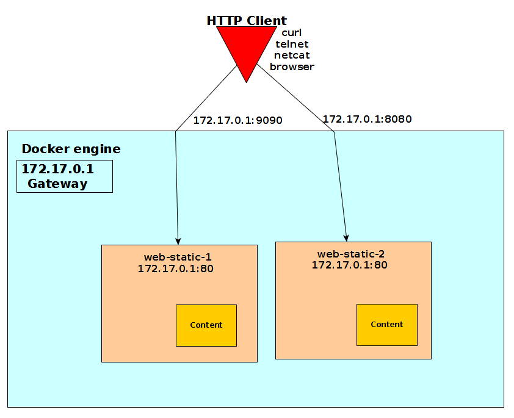
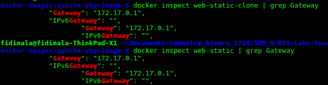
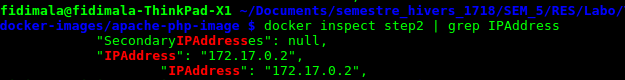
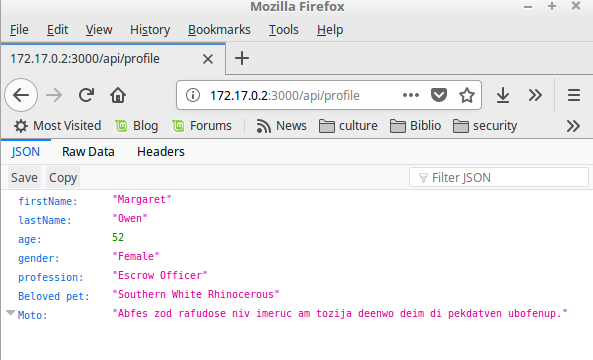

# RES - HTTP Infrastructure - Lab report
---
## Step 1 : Static HTTP server with apache httpd
On this first step, we build a simple static webpage running on dockerised Apache server. We use bootstrap's template to build quickly with our own content.
We build the content up  in `src/` in our local machine. When we create the dockerised server Apache, we copy the   `src/` folder into the local file system of the image  `/var/www/html/` according the Apache setup. The docker image is based on `php:7.0-apache` container. This container is packaged with Apache web server.

this command build the image. We assume that the current directory hold our `Dockerfile`.

how to explore the file system of the image
we execute the bash to have prompt on the container
```docker
docker exec -it container-name /bin/bash
```
We use the default apache configuration for this step. All we have to do is to building the docker image with our static content.



This below table show off our setup command

| docker command                             |            Description  |
| -------------------------------------------|:------------------:|
|  ` docker build -t res/apache-php-static .`| Building the static content web server. The    current directory hold our `Dockerfile` |
| ` docker run -d -p 9090:80 --name web-static res/apache-php-static`      | Run the container based on the image that we have been created before. This container listen on the 80 and the docker expose the port 9090.|

how to explore the file system of the image
we execute the bash to have prompt on the container

```docker
docker exec -it container-name /bin/bash
```
We inspect the container to check out his Ip adress. On linux machine, We use the docker engine Ip address because the container use docker IP like a gateway.



We run the container `web-static ` based on the image ` res/apache-php-static`. This below image show off the result.


## Step 2:  Dynamic HTTP server with express.js
### set up node server
The node-tiers help us to generate the dynamic ressource. This dynamic ressource mimics data that feed up the express.js which render web content. The express.js is our web framework. This framework provides an API to render fashion web page.
The dynamic ressource is generated by the node module `chance`. This below image show off how the dockerised node run. This node app create randomly a profile.


The express.js framework is used on top of our profile generator.

## Deployment

| docker command                             |            Description  |
| -------------------------------------------|:------------------:|
|  ` docker build -t res/step2express .`| Building the dynamic content web server image. The    current directory hold our `Dockerfile` |
| ` docker run --name step2 res/step2express`      | Run the container based on this image that we have been created before. This container listen on the 3000.|

Before we connect with our server. It's abvious to check out the container IP address. Thanks to ` docker inspect step2 | grep IPAddress` command, we easly find out this IP adress.



 We can get the random content from the express server using this address ad the right port.



## Step 3: Reverse proxy with apache (static configuration)
